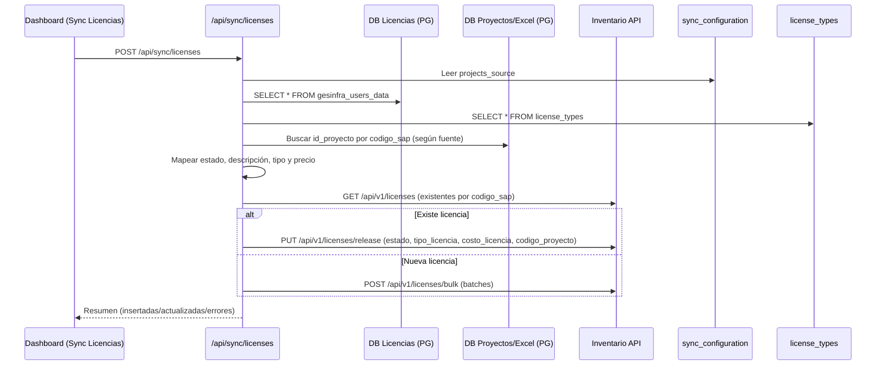
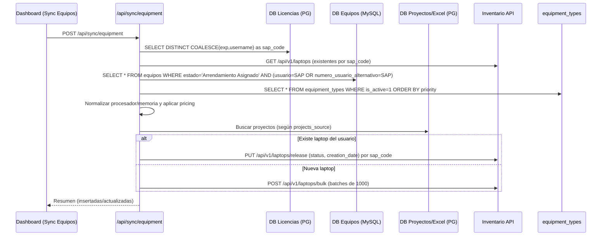
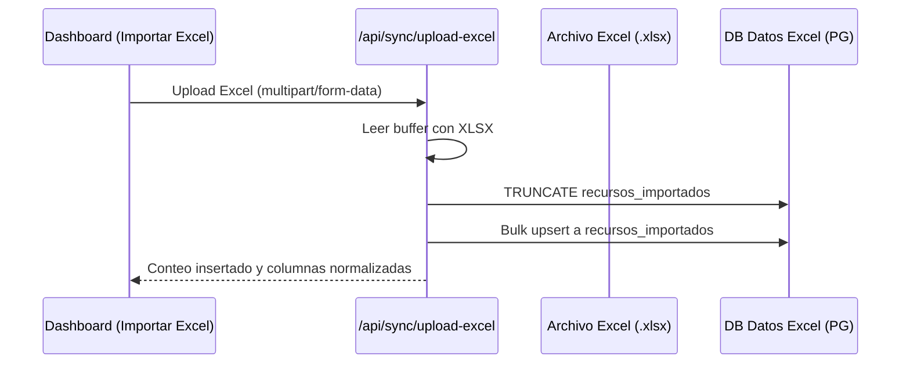
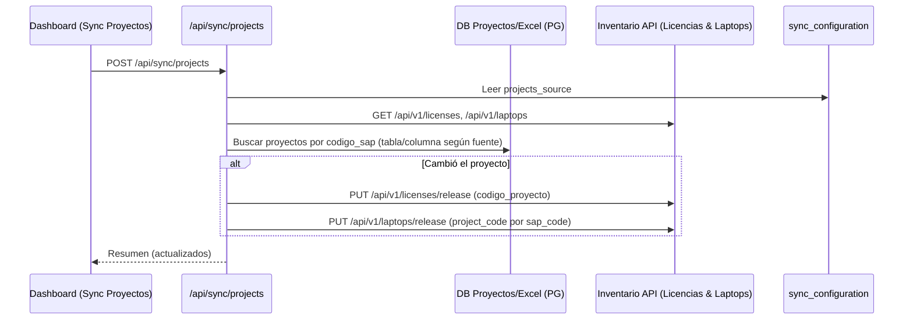
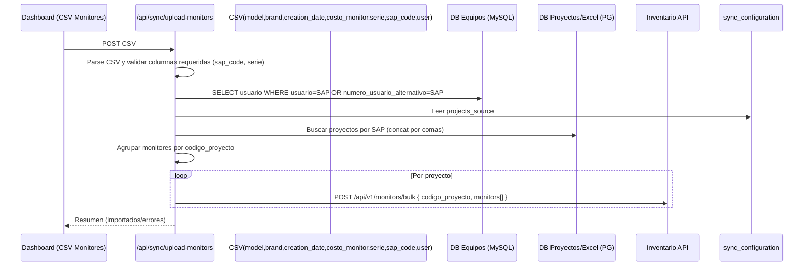
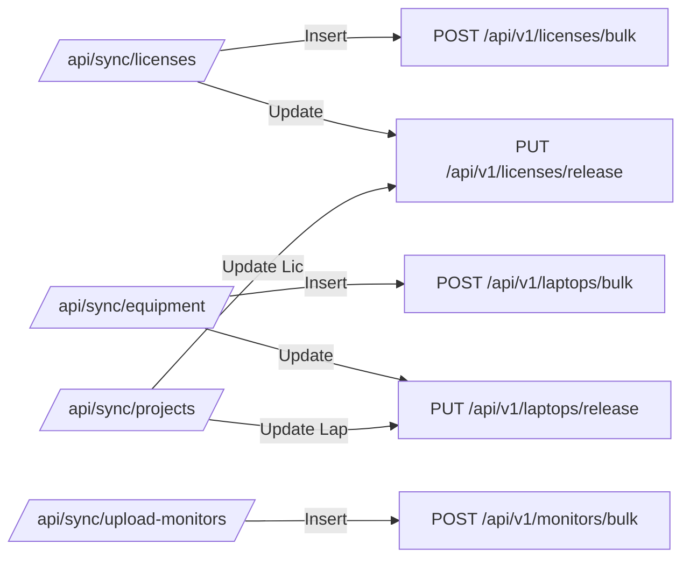

# Auth System

## Visión general de Integraciones y Sincronizaciones

```mermaid
flowchart LR
  subgraph App [Auth System NextJS API]
    A1[Integrations API]
    A2[/api/sync/licenses]
    A3[/api/sync/equipment]
    A4[/api/sync/projects]
    A5[/api/sync/upload-excel]
    A6[/api/sync/upload-monitors]
    A7[/api/sync/config]
  end

  subgraph DB_Interna [DB Interna MySQL auth_system]
    D1[integrations]
    D2[sync_configuration]
    D3[license_types]
    D4[equipment_types]
  end

  subgraph Externas
    E1[DB Licencias PG]
    E2[DB Proyectos Hitss PG]
    E3[DB Datos Excel PG]
    E4[DB Equipos MySQL]
    E5[Inventario API HTTPS Bearer]
  end

  A1 --> D1
  D1 --> A1
  A7 --> D2
  D2 --> A7

  A2 --> E1
  A2 --> E2
  A2 --> E3
  A2 --> D3
  A2 --> E5

  A3 --> E1
  A3 --> E4
  A3 --> D4
  A3 --> E5

  A4 --> E2
  A4 --> E3
  A4 --> E5

  A5 --> E3

  A6 --> E4
  A6 --> E2
  A6 --> E3
  A6 --> E5
```

## Secuencia: Sincronización de Licencias



Notas clave
- codigo_proyecto se concatena con comas cuando hay múltiples proyectos.
- Map de estados (Activo→activa, Baja/Locked_*→cesado, etc.).
- Sólo se actualizan estado, tipo_licencia, costo_licencia y codigo_proyecto.

## Secuencia: Sincronización de Equipos (Laptops)



Notas clave
- name = id_glpi; type tomado de columna tipo (Notebook, Desktop, etc.).
- creation_date = primera_fecha_asignacion (fallback: hoy).
- Proyectos concatenados por comas.

## Secuencia: Importación de Proyectos (Excel)



## Secuencia: Sincronización de Proyectos (Inventario → DBs)



## Secuencia: Importación de Monitores (CSV)



## Reglas de Validación y Fallbacks

```mermaid
flowchart TB
  A[Entrada de usuario/datos] --> B{projects_source}
  B -- datos_operacionales --> C[(Tabla datos_operacionales\ncol: id_recursohumano)]
  B -- recursos_importados --> D[(Tabla recursos_importados\ncol: id_recurso)]
  B -- both --> C & D

  C & D --> E[Proyectos encontrados?]
  E -- Sí --> F[codigo_proyecto = join(',')]
  E -- No --> G[codigo_proyecto = 51238 (default)]

  subgraph Licencias
    L1[Map estado desde DB Licencias]
    L2[Validar tipo_licencia y precio]
    L3[Actualizar si existen cambios]
  end

  subgraph Equipos
    Q1[Normalizar procesador/memoria]
    Q2[Aplicar equipment_types]
    Q3[Actualizar status/creation_date por sap_code]
  end

  subgraph Monitores
    M1[CSV requerido: sap_code y serie]
    M2[Resolver user desde DB Equipos]
    M3[Agrupar por codigo_proyecto]
  end

  F & G --> L1 & L2 & L3 & Q1 & Q2 & Q3 & M1 & M2 & M3
```

## Endpoints del Inventario utilizados



## Configuración

- Integraciones: `integrations` (DB Licencias, DB Proyectos Hitss/DB Proyectos, DB Datos Excel, DB Equipos, Api Inventario)
- Config Sync: `sync_configuration.projects_source` ∈ { `datos_operacionales`, `recursos_importados`, `both` }
- Tipos y precios: `license_types`, `equipment_types`

## Manejo de errores y tolerancias

- Timeouts y keepAlive configurados en conexiones PG.
- Batches (100/1000) para inserciones masivas.
- Fallbacks:
  - SAP sin proyecto: usa `51238`.
  - Usuario sin `exp`: usa `username` (licencias) o `usuario`/`numero_usuario_alternativo` (equipos/monitores).
  - Certificados autofirmados: `rejectUnauthorized: false` en llamadas HTTPS hacia Inventario.

# Sistema de Autenticación RADIUS

Un sistema completo de autenticación con integración RADIUS, desarrollado con Next.js 14, TypeScript y MySQL.

## 🚀 Características

- **Autenticación RADIUS**: Integración completa con servidor RADIUS
- **Gestión de Sesiones**: JWT con cookies seguras
- **Control de Acceso**: Roles de administrador y gerente
- **Logs de Auditoría**: Registro completo de actividades
- **Administrador Estático**: Usuario de emergencia
- **Interfaz Moderna**: UI con Tailwind CSS y Radix UI

## 📋 Requisitos

- Node.js 18+
- MySQL 8.0+
- Servidor RADIUS configurado
- Acceso a base de datos RADIUS

## 🛠️ Instalación

1. **Clonar el proyecto**
   ```bash
   cd /root/auth-system
   ```

2. **Instalar dependencias**
   ```bash
   npm install
   ```

3. **Configurar variables de entorno**
   ```bash
   cp env.example .env.local
   # Editar .env.local con tus configuraciones
   ```

4. **Inicializar la base de datos**
   ```bash
   npm run db:init
   ```

5. **Ejecutar en desarrollo**
   ```bash
   npm run dev
   ```

## ⚙️ Configuración

### Variables de Entorno

```env
# Base de Datos de la Aplicación
APP_DB_HOST=10.172.1.88
APP_DB_NAME=auth_system
APP_DB_USER=radiususer
APP_DB_PASSWORD=Rn.xN9f7jvZ

# Base de Datos RADIUS
RADIUS_DB_HOST=10.172.1.84
RADIUS_DB_NAME=radius_user
RADIUS_DB_USER=radiususer
RADIUS_DB_PASSWORD=Rn.xN9f7jvZ

# Servidor RADIUS
RADIUS_SERVER_HOST=10.172.1.84
RADIUS_SERVER_PORT=1812
RADIUS_SECRET=your-radius-secret

# Autenticación
JWT_SECRET=your-super-secret-jwt-key
STATIC_ADMIN_EMAIL=admin@company.com
STATIC_ADMIN_PASSWORD=Admin123!
```

## 🗄️ Estructura de Base de Datos

### Tablas Principales

- **app_users**: Usuarios de la aplicación con roles
- **app_config**: Configuración del sistema
- **app_logs**: Logs de auditoría y eventos

### Tabla RADIUS Externa

- **user_radius_access**: Control de acceso RADIUS (solo lectura)

## 🔐 Flujo de Autenticación

1. **Verificación de Admin Estático**
   - Si es admin@company.com → Acceso directo

2. **Verificación de Acceso RADIUS**
   - Consulta tabla `user_radius_access`
   - Verifica permisos para servidor RADIUS

3. **Autenticación RADIUS**
   - Envía paquete Access-Request
   - Valida credenciales contra servidor RADIUS

4. **Gestión de Usuario**
   - Crea/obtiene usuario en `app_users`
   - Asigna rol (admin/gerente)

5. **Creación de Sesión**
   - Genera JWT con información del usuario
   - Establece cookie segura

## 🎯 Uso

### Credenciales de Prueba

- **Administrador**: admin@company.com / Admin123!
- **Usuario RADIUS**: Cualquier usuario en `user_radius_access`

### Rutas Principales

- `/` - Página de login
- `/dashboard` - Dashboard de usuario
- `/dashboard/admin` - Panel de administración

## 🔧 API Endpoints

### Autenticación
- `POST /api/auth/login` - Iniciar sesión
- `POST /api/auth/logout` - Cerrar sesión
- `GET /api/auth/session` - Verificar sesión

### Administración
- `POST /api/init` - Inicializar sistema

## 🛡️ Seguridad

- **Cookies HTTPOnly**: Protección contra XSS
- **Cookies Secure**: Solo en HTTPS
- **SameSite Strict**: Protección CSRF
- **JWT con Expiración**: Sesiones temporales
- **Validación de Entrada**: Sanitización de datos
- **Logs de Auditoría**: Registro de actividades

## 📊 Monitoreo

El sistema registra todos los eventos importantes:

- Logins exitosos y fallidos
- Cambios de permisos
- Accesos administrativos
- Errores del sistema

## 🚀 Despliegue

### Producción

1. **Configurar HTTPS**
   ```env
   HTTPS_ENABLED=true
   FORCE_HTTPS=true
   ```

2. **Cambiar JWT Secret**
   ```env
   JWT_SECRET=your-production-secret-key
   ```

3. **Build y Start**
   ```bash
   npm run build
   npm start
   ```

### Docker (Opcional)

```dockerfile
FROM node:18-alpine
WORKDIR /app
COPY package*.json ./
RUN npm ci --only=production
COPY . .
RUN npm run build
EXPOSE 3000
CMD ["npm", "start"]
```

## 🔍 Troubleshooting

### Problemas Comunes

1. **Error de conexión RADIUS**
   - Verificar configuración del servidor
   - Comprobar firewall y puertos
   - Validar secret compartido

2. **Error de base de datos**
   - Verificar credenciales
   - Comprobar conectividad
   - Ejecutar inicialización

3. **Sesión no válida**
   - Verificar JWT_SECRET
   - Comprobar cookies
   - Validar expiración

## 📝 Logs

Los logs se almacenan en la tabla `app_logs` con la siguiente estructura:

- **event_type**: Tipo de evento
- **user_principal_name**: Usuario afectado
- **ip_address**: IP de origen
- **details**: Detalles del evento
- **status**: Estado (success/error/warning)
- **created_at**: Timestamp

## 🤝 Contribución

1. Fork el proyecto
2. Crear rama feature (`git checkout -b feature/nueva-funcionalidad`)
3. Commit cambios (`git commit -am 'Agregar nueva funcionalidad'`)
4. Push a la rama (`git push origin feature/nueva-funcionalidad`)
5. Crear Pull Request

## 📄 Licencia

Este proyecto está bajo la Licencia MIT. Ver `LICENSE` para más detalles.

## 📞 Soporte

Para soporte técnico o preguntas:

- Crear un issue en el repositorio
- Contactar al equipo de desarrollo
- Revisar la documentación técnica

---

**Desarrollado con ❤️ usando Next.js, TypeScript y RADIUS**
