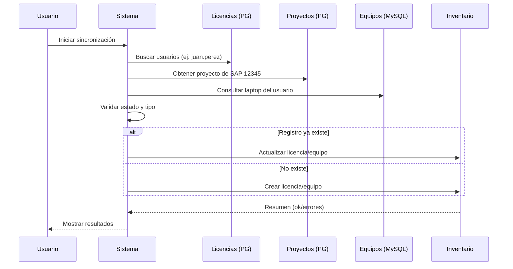
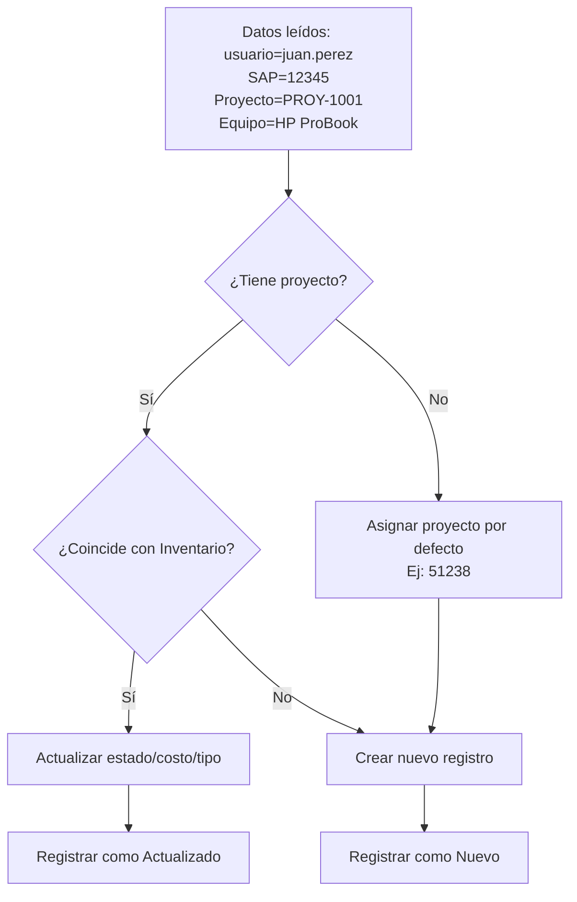
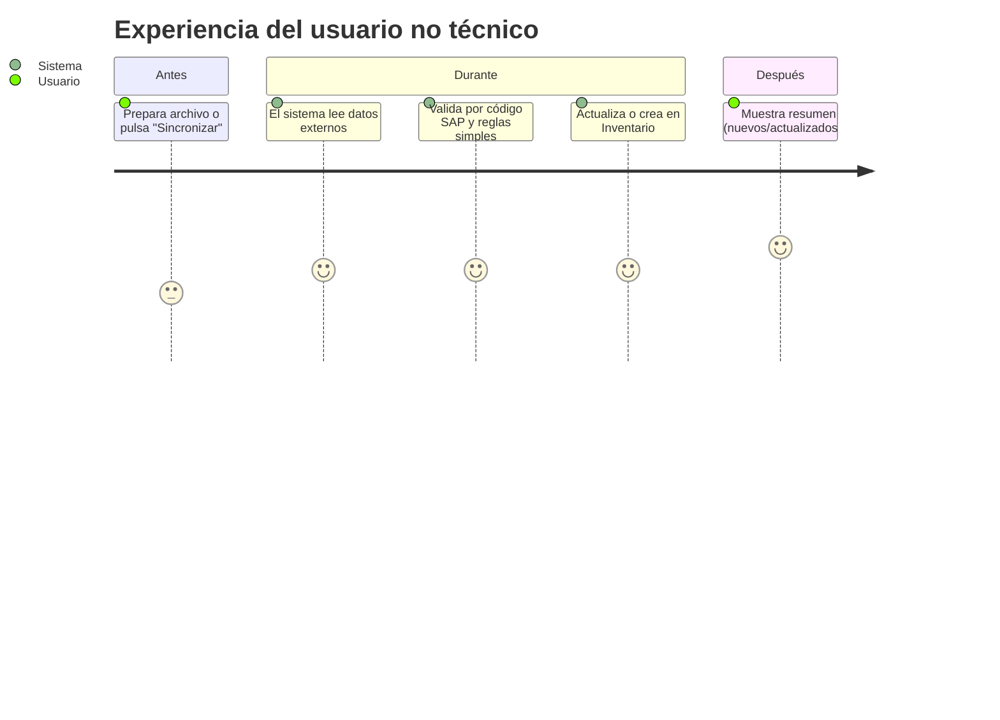
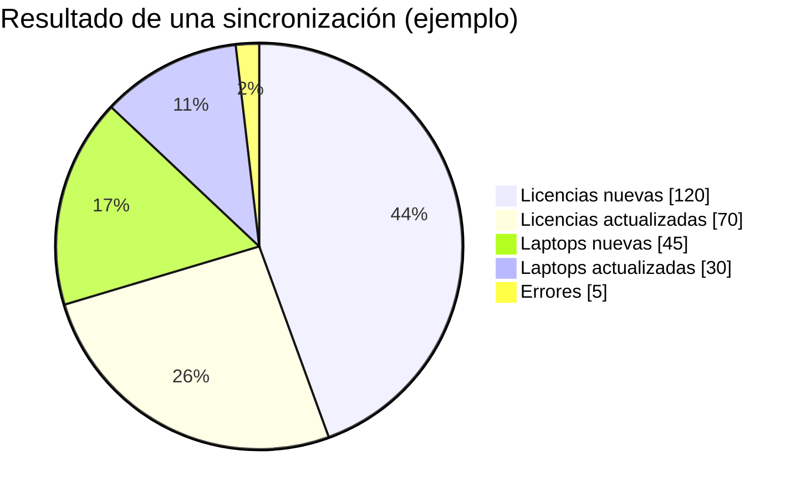
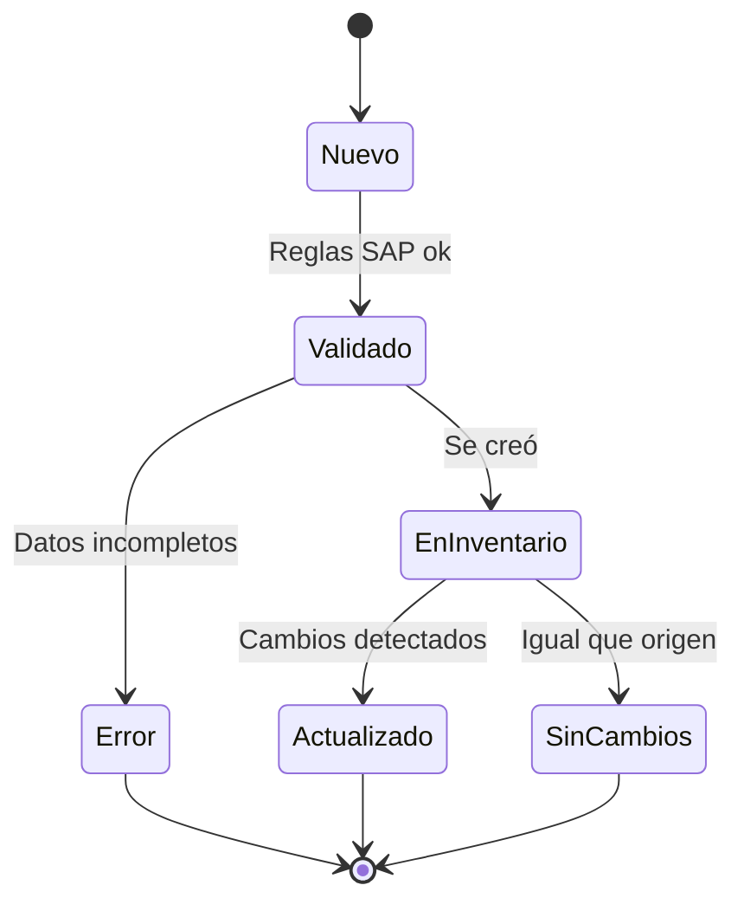
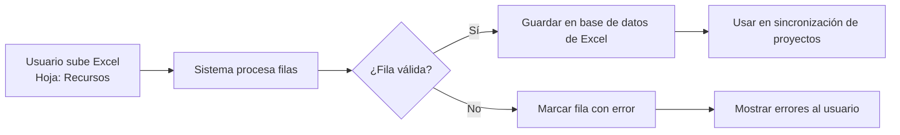
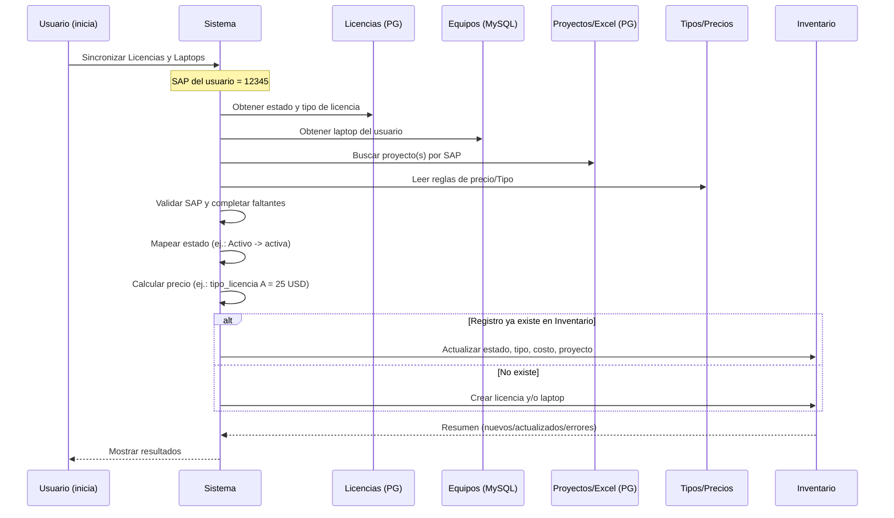
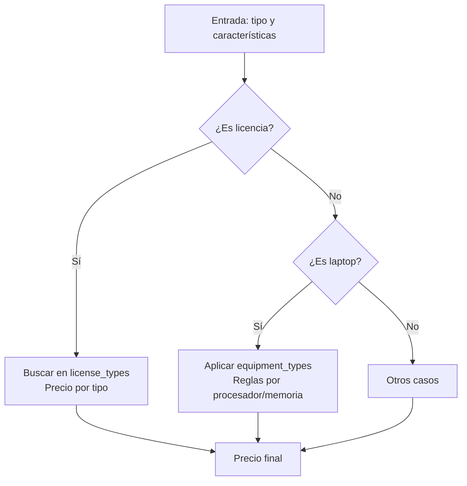

```mermaid
%% Frecuencia y tiempos (gantt)
gantt
  title Frecuencias típicas de sincronización (ejemplo)
  dateFormat  HH:mm
  axisFormat  %H:%M
  section Diario
  Licencias (rápido)        :done,    09:00, 30m
  Laptops (medio)           :active,  10:00, 45m
  section Semanal
  Proyectos (revisión)      :         11:00, 1h
  Monitores (por lotes)     :         14:00, 45m
```

```mermaid
%% Visión general muy simple del sistema
flowchart LR
  U[Usuario inicia sincronización] --> S[Sistema de Integración]

  subgraph Fuentes Externas
    L[Licencias (PostgreSQL)<br/>Ej: usuario: juan.perez]
    P[Proyectos (PostgreSQL)<br/>Ej: PROY-1001]
    X[Datos Excel (PostgreSQL)<br/>Ej: Hoja: Recursos]
    E[Equipos (MySQL)<br/>Ej: Laptop: HP ProBook]
  end

  S --> L
  S --> P
  S --> X
  S --> E

  S --> V[Valida con código SAP<br/>Ej: 12345]
  V --> D{¿Existe en Inventario?}
  D -- Sí --> ACT[Actualizar datos]
  D -- No --> INS[Crear registro]

  subgraph Inventario (Destino)
    INV[Licencias y Equipos]
  end

  ACT --> INV
  INS --> INV

  INV --> R[Resumen simple<br/>Ej: 150 nuevas, 80 actualizadas]
```















```mermaid
%% Sincronizaciones: Licencias, Laptops y Proyectos (resumen no técnico)
flowchart LR
  subgraph Fuentes
    L[Licencias (PostgreSQL)<br/>Usuarios y estados]
    EQ[Equipos (MySQL)<br/>Laptops por usuario]
    PR[Proyectos (PostgreSQL)<br/>Tabla proyectos]
    XL[Excel (PostgreSQL)<br/>Recursos importados]
    CFG[Configuración (MySQL)<br/>sync_configuration]
    LT[Tablas de tipos y precios<br/>license_types / equipment_types]
  end

  S[Sistema de Integración] --> L
  S --> EQ
  S --> PR
  S --> XL
  S --> CFG
  S --> LT

  L & EQ & PR & XL & CFG & LT --> V[Validar por código SAP<br/>Reglas simples de negocio]

  V --> MAP[Mapear estado/tipo<br/>Calcular precio]
  MAP --> INV{¿Existe en Inventario?}
  INV -- Sí --> UPD[Actualizar datos]
  INV -- No --> INS[Crear nuevo]

  subgraph Destino
    I1[Inventario - Licencias]
    I2[Inventario - Laptops]
  end

  UPD --> I1 & I2
  INS --> I1 & I2
```






