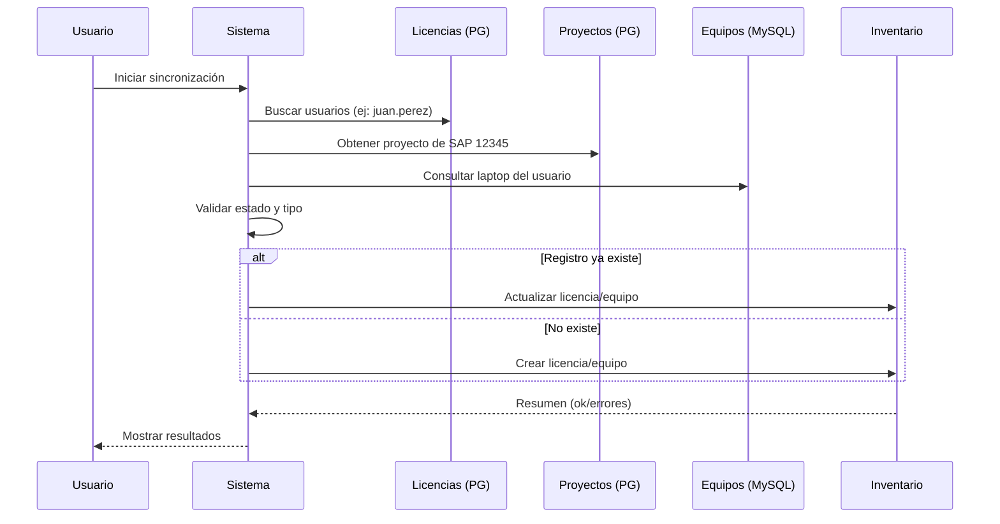
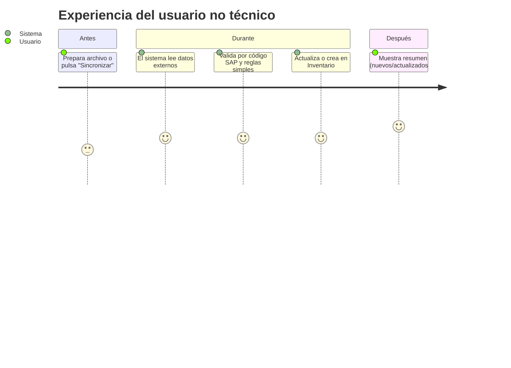
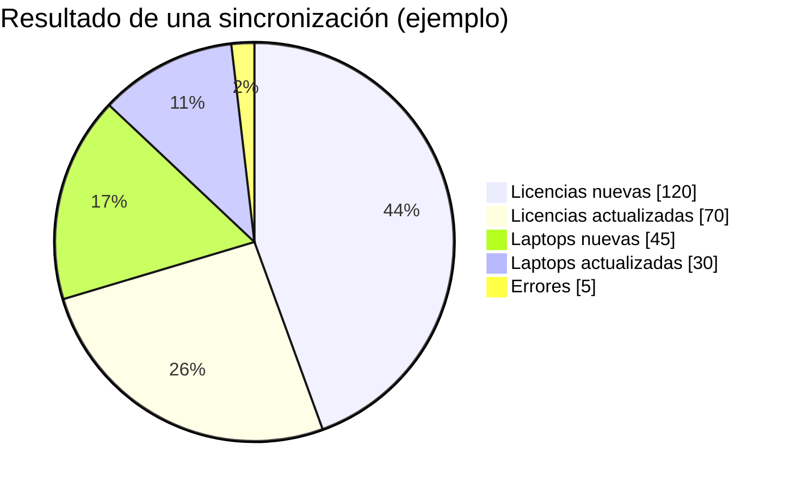
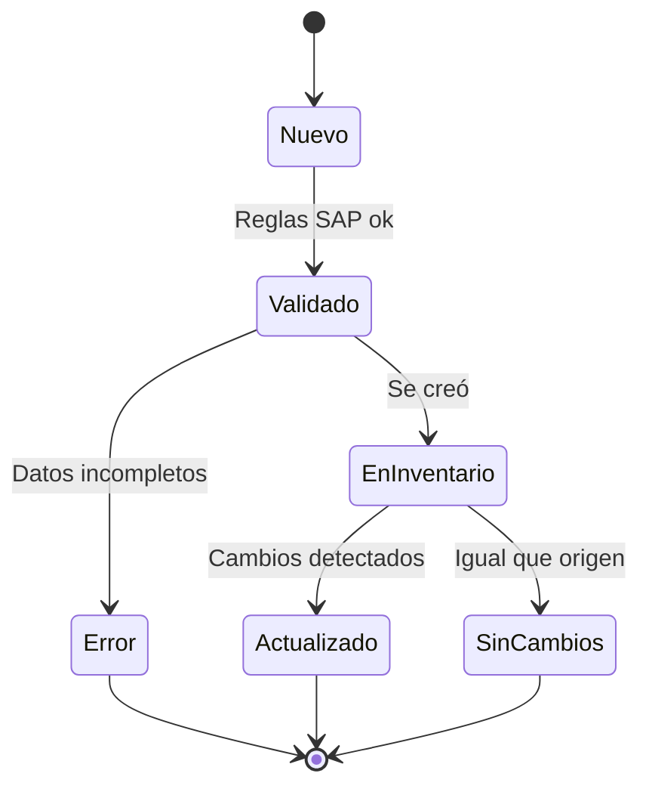
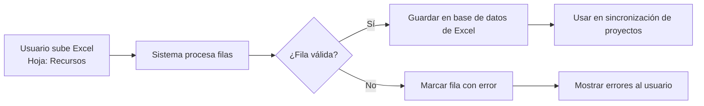

```mermaid
%% Frecuencia y tiempos (gantt)
gantt
  title Frecuencias típicas de sincronización (ejemplo)
  dateFormat  HH:mm
  axisFormat  %H:%M
  section Diario
  Licencias (rápido)        :done,    09:00, 30m
  Laptops (medio)           :active,  10:00, 45m
  section Semanal
  Proyectos (revisión)      :         11:00, 1h
  Monitores (por lotes)     :         14:00, 45m
```

```mermaid
%% Visión general muy simple del sistema
flowchart LR
  U[Usuario inicia sincronización] --> S[Sistema de Integración]

  subgraph Fuentes Externas
    L[Licencias (PostgreSQL)\nEj: usuario: juan.perez]
    P[Proyectos (PostgreSQL)\nEj: PROY-1001]
    X[Datos Excel (PostgreSQL)\nEj: Hoja: Recursos]
    E[Equipos (MySQL)\nEj: Laptop: HP ProBook]
  end

  S --> L
  S --> P
  S --> X
  S --> E

  S --> V[Valida con código SAP\nEj: 12345]
  V --> D{¿Existe en Inventario?}
  D -- Sí --> ACT[Actualizar datos]
  D -- No --> INS[Crear registro]

  subgraph Inventario (Destino)
    INV[Licencias y Equipos]\n
  end

  ACT --> INV
  INS --> INV

  INV --> R[Resumen simple\nEj: 150 nuevas, 80 actualizadas]
```



```mermaid
%% Decisiones principales (no técnico)
flowchart TB
  A[Datos leídos: usuario=juan.perez\nSAP=12345\nProyecto=PROY-1001\nEquipo=HP ProBook]
  A --> B{¿Tiene proyecto?}
  B -- Sí --> C{¿Coincide con Inventario?}
  B -- No --> D[Asignar proyecto por defecto\nEj: 51238]
  C -- Sí --> E[Actualizar estado/costo/tipo]
  C -- No --> F[Crear nuevo registro]
  D --> F
  E --> G[Registrar como "Actualizado"]
  F --> H[Registrar como "Nuevo"]
```












