# Matriz de Aplicaciones y Permisos - ADPER.HITSS.MX

## Matriz en formato tabla (similar a la imagen)

| Rol | ACTIVA | RADIUS INTERNO | Integrador | Wapper | NETpoint | VMBackup | Vcenter | Influxdb | Vaultwarden | Odoo | grafana | Monitor de Servicios | issabelpbx | truenas | elastic | Fileserver | AD |
|-----|--------|----------------|------------|--------|----------|----------|---------|----------|-------------|------|---------|---------------------|------------|---------|---------|------------|----|
| | Administrador | Gerente | Administrador | Operador | Administrador | Administrador | Administrador | Operador N2 | Operador N1 | Administrador | Administrador | Operador | Administrador | View | Administrador | Administrador | Administrador | Operador | Administrador | Operador | Administrador | Operador |
| | | | | | | | | | | | | | | | | | | | | | | | | Operador N1 |
| **Alta Gerencia** | | | | | | | | | | | | | | | | | | |
| CEO | | | | | | | | | | | | | | | | | |
| COO | | | | | | | | | | | | | | | | | |
| CTO | | | | | | | | | | | | | | | | | |
| CFO | | | | | | | | | | | | | | | | | |
| CTIO | | | | | | | | | | | | | | | | | |
| **Tecnología** | | | | | | | | | | | | | | | | | |
| Developers | | | | | | | | | | | | | | | | | |
| Lider Tecnico | | | | | | | | | | | | | | | | | |
| Operaciones TI | | | | | | | | | | | | | | | | | |
| Responsable de Infraestructura | | | | | | | | | | | | | | | | | |
| **Administradores** | | | | | | | | | | | | | | | | | |
| Administrador de Servidores | | X | X | X | X | X | X | X | X | X | X | X | X | X | X | X | X | X |
| Administrador de Redes | X | X | | | X | | | X | | X | X | X | | | | X | | | |
| Coordinador de Soporte | | X | | | | | | X | | | | | | | | | |
| **Soporte** | | | | | | | | | | | | | | | | | |
| Soporte N1 | | X | | | | | | X | | | | | | | | X | X | |
| Personal de N1 | | | | | | | | X | | | | | | | | | | |
| **Gerencia** | | | | | | | | | | | | | | | | | |
| Gerente | X | | | | | | | | | | | | | | | | |

---

## Diagrama Mermaid - Matriz de Permisos

```mermaid
graph TB
    subgraph Aplicaciones[" "]
        A1[ACTIVA]
        A2[RADIUS INTERNO]
        A3[Integrador]
        A4[Wapper]
        A5[NETpoint]
        A6[VMBackup]
        A7[Vcenter]
        A8[Influxdb]
        A9[Vaultwarden]
        A10[Odoo]
        A11[grafana]
        A12[Monitor Servicios]
        A13[issabelpbx]
        A14[truenas]
        A15[elastic]
        A16[Fileserver]
        A17[AD]
    end
    
    subgraph Roles[" "]
        R1[CEO]
        R2[COO]
        R3[CTO]
        R4[CFO]
        R5[CTIO]
        R6[Developers]
        R7[Lider Tecnico]
        R8[Operaciones TI]
        R9[Responsable Infraestructura]
        R10[Admin Servidores]
        R11[Admin Redes]
        R12[Coordinador Soporte]
        R13[Soporte N1]
        R14[Personal N1]
        R15[Gerente]
    end
    
    R10 -->|X| A1
    R10 -->|X| A2
    R10 -->|X| A3
    R10 -->|X| A4
    R10 -->|X| A5
    R10 -->|X| A6
    R10 -->|X| A7
    R10 -->|X| A8
    R10 -->|X| A9
    R10 -->|X| A10
    R10 -->|X| A11
    R10 -->|X| A12
    R10 -->|X| A13
    R10 -->|X| A14
    R10 -->|X| A15
    R10 -->|X| A16
    R10 -->|X| A17
    
    R11 -->|X| A1
    R11 -->|X| A2
    R11 -->|X| A5
    R11 -->|X| A7
    R11 -->|X| A9
    R11 -->|X| A10
    R11 -->|X| A11
    R11 -->|X| A15
    
    R12 -->|X| A2
    R12 -->|X| A7
    
    R13 -->|X| A2
    R13 -->|X| A7
    R13 -->|X| A16
    R13 -->|X| A17
    
    R14 -->|X| A7
    
    R15 -->|X| A1
    
    style R1 fill:#ffcccc
    style R2 fill:#ffcccc
    style R3 fill:#ffcccc
    style R4 fill:#ffcccc
    style R5 fill:#ffcccc
    style R6 fill:#ffcccc
    style R7 fill:#ffcccc
    style R8 fill:#ffcccc
    style R9 fill:#ffcccc
    style R10 fill:#ccffcc
    style R11 fill:#ccffcc
    style R12 fill:#ccffcc
    style R13 fill:#ccffcc
    style R14 fill:#ccffcc
    style R15 fill:#ccffcc
```



---

## Matriz HTML (más similar a la imagen, editable)

```html
<table border="1" cellpadding="5" cellspacing="0">
<tr>
    <th rowspan="2">Rol</th>
    <th colspan="2">ACTIVA</th>
    <th colspan="2">RADIUS INTERNO</th>
    <th colspan="1">Integrador</th>
    <th colspan="1">Wapper</th>
    <th colspan="1">NETpoint</th>
    <th colspan="1">VMBackup</th>
    <th colspan="3">Vcenter</th>
    <th colspan="1">Influxdb</th>
    <th colspan="2">Vaultwarden</th>
    <th colspan="1">Odoo</th>
    <th colspan="2">grafana</th>
    <th colspan="1">Monitor de Servicios</th>
    <th colspan="1">issabelpbx</th>
    <th colspan="1">truenas</th>
    <th colspan="2">elastic</th>
    <th colspan="2">Fileserver</th>
    <th colspan="2">AD</th>
</tr>
<tr>
    <th>Administrador</th>
    <th>Gerente</th>
    <th>Administrador</th>
    <th>Operador</th>
    <th>Administrador</th>
    <th>Administrador</th>
    <th>Administrador</th>
    <th>Administrador</th>
    <th>Administrador</th>
    <th>Operador N2</th>
    <th>Operador N1</th>
    <th>Administrador</th>
    <th>Administrador</th>
    <th>Operador</th>
    <th>Administrador</th>
    <th>Administrador</th>
    <th>View</th>
    <th>Administrador</th>
    <th>Administrador</th>
    <th>Administrador</th>
    <th>Administrador</th>
    <th>Operador</th>
    <th>Administrador</th>
    <th>Operador</th>
    <th>Administrador</th>
    <th>Operador N1</th>
</tr>
<tr>
    <td><strong>Alta Gerencia</strong></td>
    <td></td><td></td><td></td><td></td><td></td><td></td><td></td><td></td><td></td><td></td><td></td><td></td><td></td><td></td><td></td><td></td><td></td><td></td><td></td><td></td><td></td><td></td><td></td><td></td><td></td><td></td>
</tr>
<tr>
    <td>CEO</td>
    <td></td><td></td><td></td><td></td><td></td><td></td><td></td><td></td><td></td><td></td><td></td><td></td><td></td><td></td><td></td><td></td><td></td><td></td><td></td><td></td><td></td><td></td><td></td><td></td><td></td><td></td>
</tr>
<tr>
    <td>COO</td>
    <td></td><td></td><td></td><td></td><td></td><td></td><td></td><td></td><td></td><td></td><td></td><td></td><td></td><td></td><td></td><td></td><td></td><td></td><td></td><td></td><td></td><td></td><td></td><td></td><td></td><td></td>
</tr>
<tr>
    <td>CTO</td>
    <td></td><td></td><td></td><td></td><td></td><td></td><td></td><td></td><td></td><td></td><td></td><td></td><td></td><td></td><td></td><td></td><td></td><td></td><td></td><td></td><td></td><td></td><td></td><td></td><td></td><td></td>
</tr>
<tr>
    <td>CFO</td>
    <td></td><td></td><td></td><td></td><td></td><td></td><td></td><td></td><td></td><td></td><td></td><td></td><td></td><td></td><td></td><td></td><td></td><td></td><td></td><td></td><td></td><td></td><td></td><td></td><td></td><td></td>
</tr>
<tr>
    <td>CTIO</td>
    <td></td><td></td><td></td><td></td><td></td><td></td><td></td><td></td><td></td><td></td><td></td><td></td><td></td><td></td><td></td><td></td><td></td><td></td><td></td><td></td><td></td><td></td><td></td><td></td><td></td><td></td>
</tr>
<tr>
    <td><strong>Tecnología</strong></td>
    <td></td><td></td><td></td><td></td><td></td><td></td><td></td><td></td><td></td><td></td><td></td><td></td><td></td><td></td><td></td><td></td><td></td><td></td><td></td><td></td><td></td><td></td><td></td><td></td><td></td><td></td>
</tr>
<tr>
    <td>Developers</td>
    <td></td><td></td><td></td><td></td><td></td><td></td><td></td><td></td><td></td><td></td><td></td><td></td><td></td><td></td><td></td><td></td><td></td><td></td><td></td><td></td><td></td><td></td><td></td><td></td><td></td><td></td>
</tr>
<tr>
    <td>Lider Tecnico</td>
    <td></td><td></td><td></td><td></td><td></td><td></td><td></td><td></td><td></td><td></td><td></td><td></td><td></td><td></td><td></td><td></td><td></td><td></td><td></td><td></td><td></td><td></td><td></td><td></td><td></td><td></td>
</tr>
<tr>
    <td>Operaciones TI</td>
    <td></td><td></td><td></td><td></td><td></td><td></td><td></td><td></td><td></td><td></td><td></td><td></td><td></td><td></td><td></td><td></td><td></td><td></td><td></td><td></td><td></td><td></td><td></td><td></td><td></td><td></td>
</tr>
<tr>
    <td>Responsable de Infraestructura</td>
    <td></td><td></td><td></td><td></td><td></td><td></td><td></td><td></td><td></td><td></td><td></td><td></td><td></td><td></td><td></td><td></td><td></td><td></td><td></td><td></td><td></td><td></td><td></td><td></td><td></td><td></td>
</tr>
<tr>
    <td><strong>Administradores</strong></td>
    <td></td><td></td><td></td><td></td><td></td><td></td><td></td><td></td><td></td><td></td><td></td><td></td><td></td><td></td><td></td><td></td><td></td><td></td><td></td><td></td><td></td><td></td><td></td><td></td><td></td><td></td>
</tr>
<tr>
    <td>Administrador de Servidores</td>
    <td>X</td><td></td><td>X</td><td></td><td>X</td><td>X</td><td>X</td><td>X</td><td>X</td><td></td><td>X</td><td>X</td><td></td><td>X</td><td>X</td><td></td><td>X</td><td>X</td><td>X</td><td>X</td><td>X</td><td>X</td><td></td><td>X</td><td></td>
</tr>
<tr>
    <td>Administrador de Redes</td>
    <td>X</td><td></td><td>X</td><td></td><td></td><td></td><td>X</td><td></td><td>X</td><td></td><td>X</td><td>X</td><td>X</td><td>X</td><td></td><td></td><td>X</td><td></td><td></td><td></td><td></td><td>X</td><td></td><td></td><td></td>
</tr>
<tr>
    <td>Coordinador de Soporte</td>
    <td></td><td></td><td>X</td><td></td><td></td><td></td><td></td><td></td><td>X</td><td></td><td></td><td></td><td></td><td></td><td></td><td></td><td></td><td></td><td></td><td></td><td></td><td></td><td></td><td></td><td></td><td></td>
</tr>
<tr>
    <td><strong>Soporte</strong></td>
    <td></td><td></td><td></td><td></td><td></td><td></td><td></td><td></td><td></td><td></td><td></td><td></td><td></td><td></td><td></td><td></td><td></td><td></td><td></td><td></td><td></td><td></td><td></td><td></td><td></td><td></td>
</tr>
<tr>
    <td>Soporte N1</td>
    <td></td><td></td><td></td><td>X</td><td></td><td></td><td></td><td></td><td></td><td>X</td><td></td><td></td><td></td><td></td><td></td><td></td><td></td><td></td><td></td><td></td><td></td><td></td><td>X</td><td></td><td>X</td><td></td>
</tr>
<tr>
    <td>Personal de N1</td>
    <td></td><td></td><td></td><td></td><td></td><td></td><td></td><td></td><td></td><td></td><td>X</td><td></td><td></td><td></td><td></td><td></td><td></td><td></td><td></td><td></td><td></td><td></td><td></td><td></td><td></td><td></td>
</tr>
<tr>
    <td><strong>Gerencia</strong></td>
    <td></td><td></td><td></td><td></td><td></td><td></td><td></td><td></td><td></td><td></td><td></td><td></td><td></td><td></td><td></td><td></td><td></td><td></td><td></td><td></td><td></td><td></td><td></td><td></td><td></td><td></td>
</tr>
<tr>
    <td>Gerente</td>
    <td></td><td>X</td><td></td><td></td><td></td><td></td><td></td><td></td><td></td><td></td><td></td><td></td><td></td><td></td><td></td><td></td><td></td><td></td><td></td><td></td><td></td><td></td><td></td><td></td><td></td><td></td>
</tr>
</table>
```

---

## Notas

- Las marcas **X** indican que el rol tiene acceso a ese perfil de la aplicación
- **Alta Gerencia** (CEO, COO, CTO, CFO, CTIO): Sin acceso a ninguna aplicación
- **Tecnología** (Developers, Lider Tecnico, Operaciones TI, Responsable de Infraestructura): Sin acceso a ninguna aplicación
- Solo roles técnicos específicos tienen acceso (Administrador de Servidores, Administrador de Redes, Soporte N1, etc.)
- **Gerente** solo tiene acceso a ACTIVA (perfil Gerente)

**Edición:**
- La tabla Markdown puede editarse directamente
- El HTML puede copiarse y pegarse en Excel o editores HTML
- El diagrama Mermaid puede editarse en https://mermaid.live o VS Code
