# Diagrama de Flujo - Sistema de Auto-Sincronización de Usuarios (Mermaid)

## Flujo Principal del Sistema

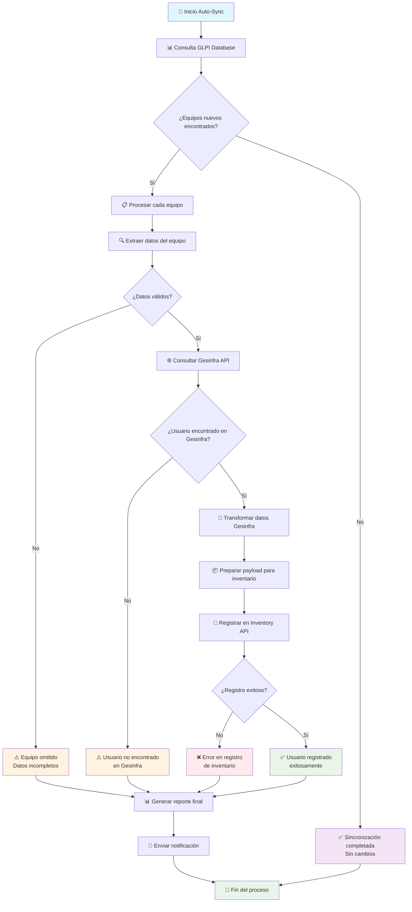

## Dependencias Críticas del GLPI

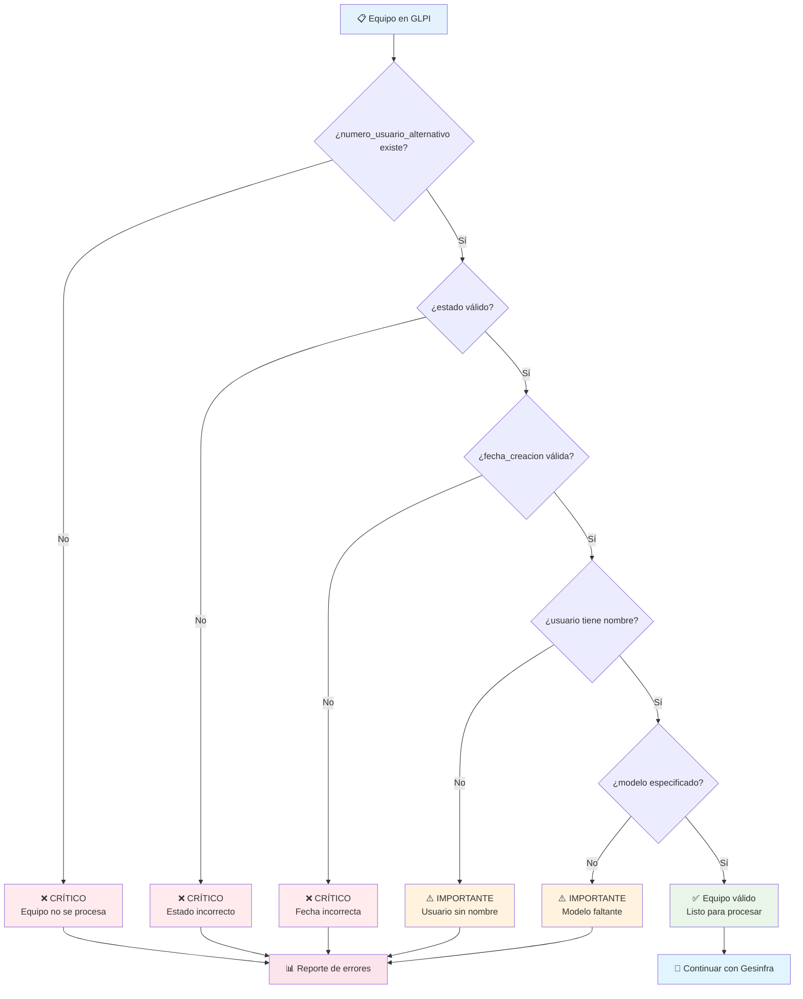

## Estados Válidos en GLPI

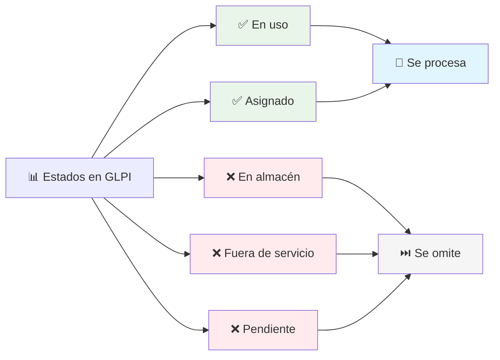

## Flujo de APIs

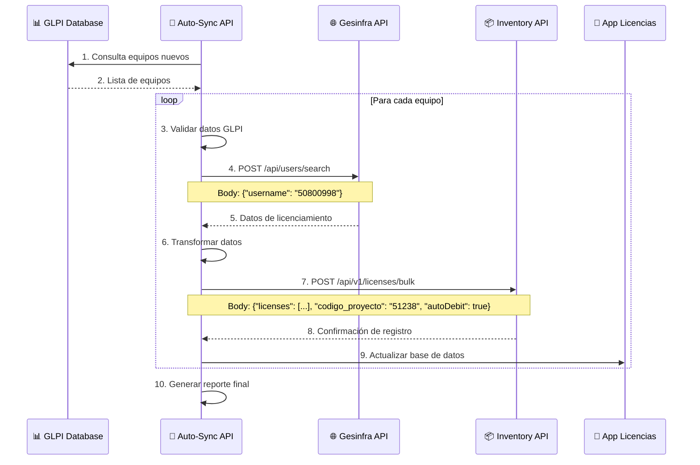

## Estructura de Datos

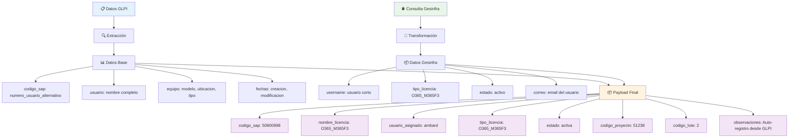

## Manejo de Errores

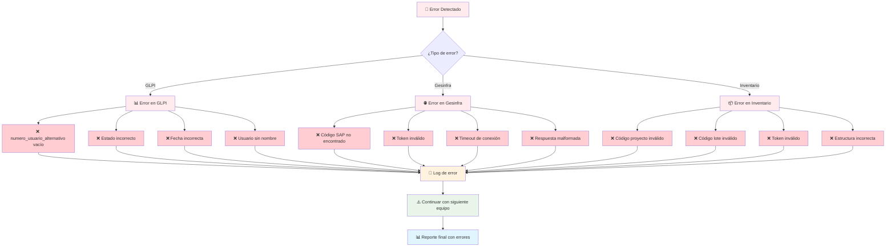

## Métricas de Calidad

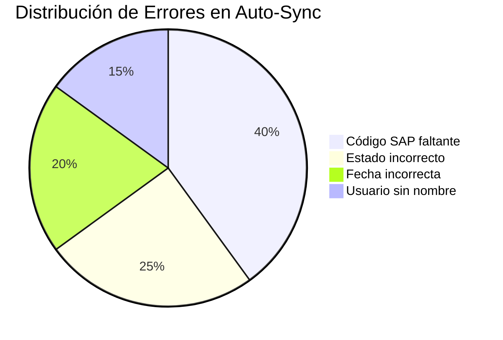

## Arquitectura del Sistema

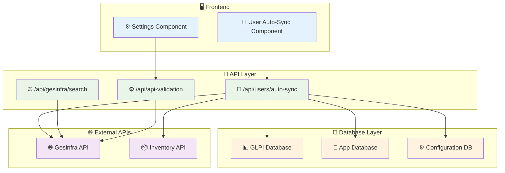

## Proceso de Validación

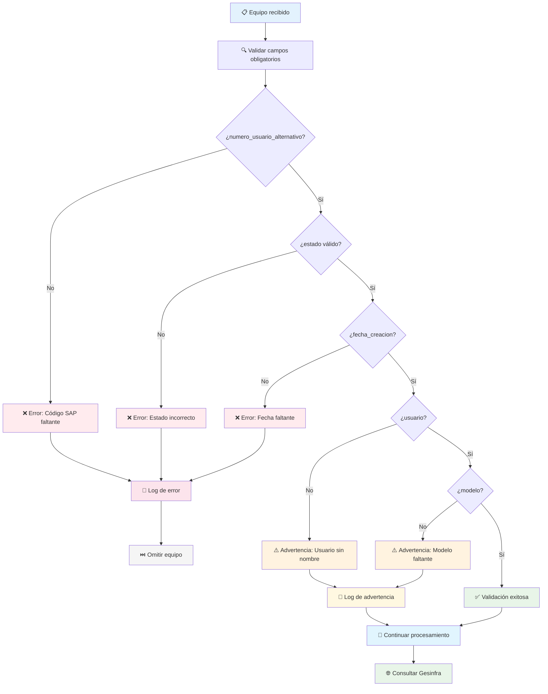

## Flujo de Configuración

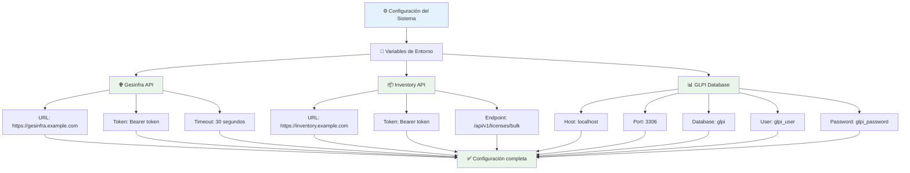

## Resumen de Dependencias

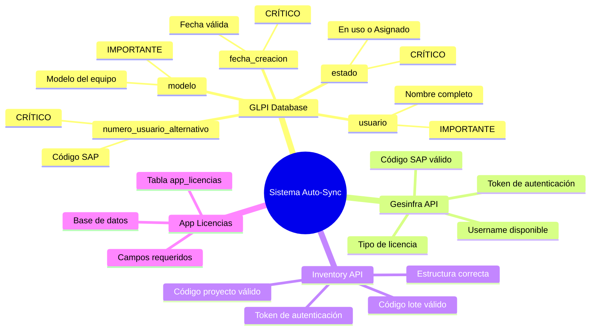

---

**Nota**: Estos diagramas Mermaid pueden ser renderizados en cualquier editor que soporte Mermaid (como GitHub, GitLab, o editores online) para visualizar el flujo completo del sistema de auto-sincronización.
