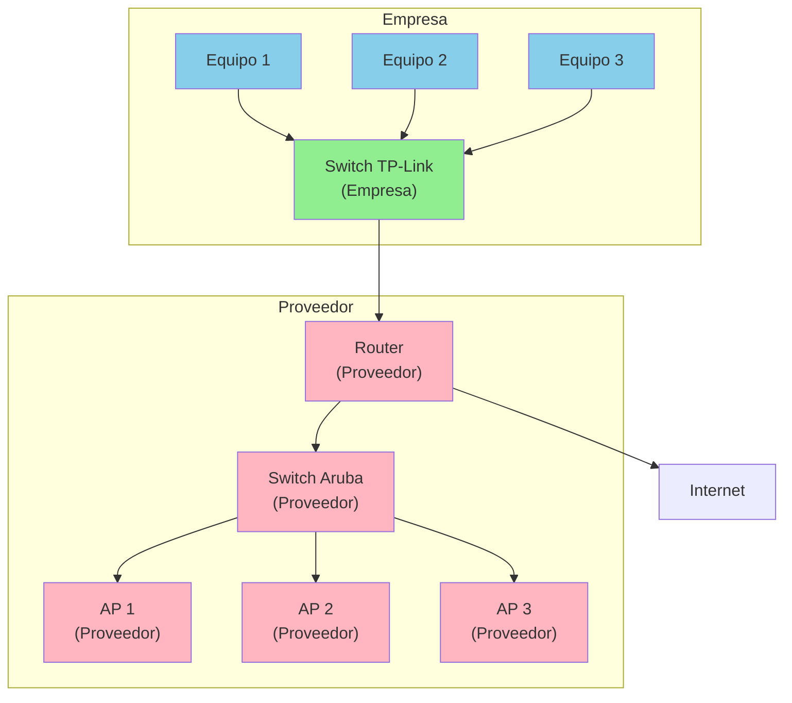
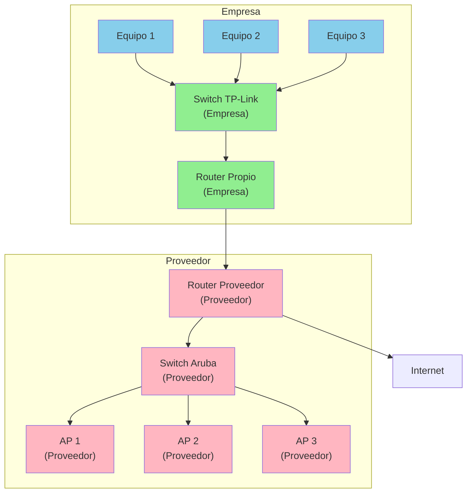

# Topologías de Red

## Topología 1: Infraestructura con Equipos del Proveedor

**Leyenda:**
- 🟢 Verde: Equipos de la Empresa
- 🔴 Rosa: Equipos del Proveedor
- 🔵 Azul: Equipos de Usuario

**Descripción:**
- La empresa solo posee un **Switch TP-Link** que conecta los equipos internos
- El **Router** y el **Switch Aruba** pertenecen al proveedor
- Los **APs (Access Points)** también son del proveedor y están conectados al Switch Aruba
- El Router del proveedor proporciona la conexión a Internet

---

## Topología 2: Infraestructura con Router Propio de la Empresa

**Leyenda:**
- 🟢 Verde: Equipos de la Empresa
- 🔴 Rosa: Equipos del Proveedor
- 🔵 Azul: Equipos de Usuario

**Descripción:**
- La empresa posee su propio **Router** y un **Switch TP-Link**
- El Router de la empresa se conecta al **Router del Proveedor** para obtener acceso a Internet
- El **Switch Aruba** y los **APs** siguen siendo del proveedor
- Esta configuración permite a la empresa tener mayor control sobre su red interna antes de salir a Internet

---

## Comparación de Topologías

| Aspecto | Topología 1 | Topología 2 |
|---------|-------------|-------------|
| Router Empresa | ❌ No | ✅ Sí |
| Control de Red | Limitado | Mayor control |
| Gestión de Tráfico | Depende del proveedor | Control interno |
| Costo | Menor | Mayor (router propio) |
| Seguridad | Básica | Mejor (firewall propio) |

