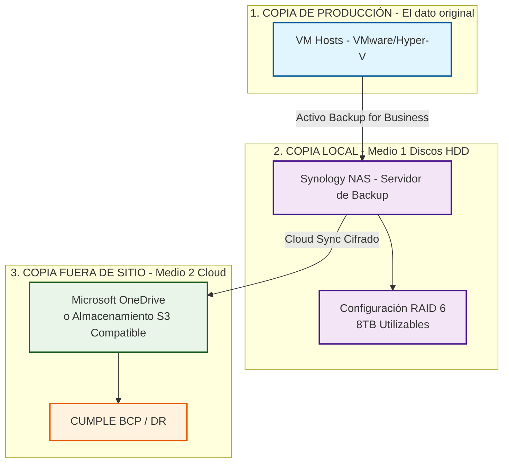

## 📊 Estrategia de Backup 3-2-1

```mermaid
flowchart TD
    subgraph "1. COPIA DE PRODUCCIÓN - El dato original"
        A[VM Hosts - VMware/Hyper-V]
    end
    
    A -->|Activo Backup for Business| B
    
    subgraph "2. COPIA LOCAL - Medio 1 Discos HDD"
        B[Synology NAS - Servidor de Backup]
        B --> C[Configuración RAID 6<br/>8TB Utilizables]
    end
    
    B -->|Cloud Sync Cifrado| D
    
    subgraph "3. COPIA FUERA DE SITIO - Medio 2 Cloud"
        D[Microsoft OneDrive<br/>o Almacenamiento S3 Compatible]
        D --> E[CUMPLE BCP / DR]
    end
    
    style A fill:#e1f5fe,stroke:#01579b,stroke-width:2px
    style B fill:#f3e5f5,stroke:#4a148c,stroke-width:2px
    style C fill:#f3e5f5,stroke:#4a148c,stroke-width:2px
    style D fill:#e8f5e8,stroke:#1b5e20,stroke-width:2px
    style E fill:#fff3e0,stroke:#e65100,stroke-width:2px
```
