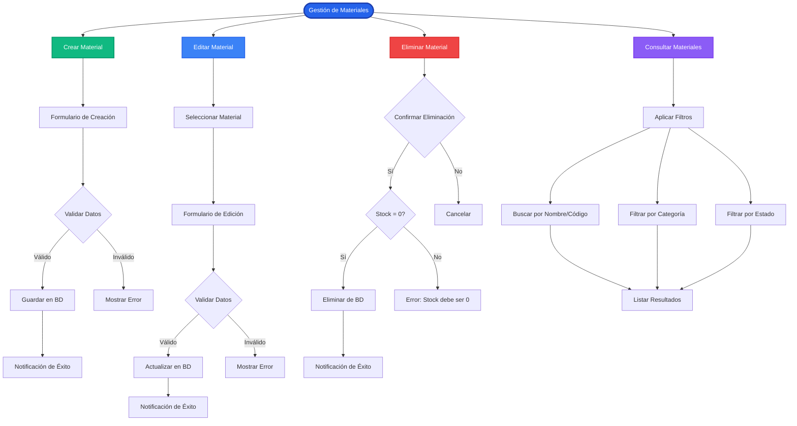
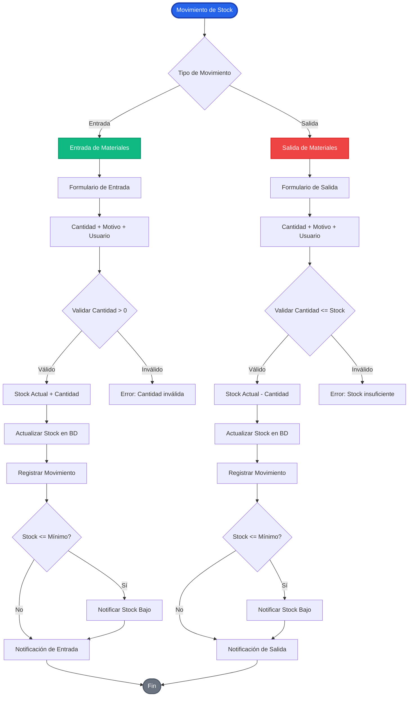
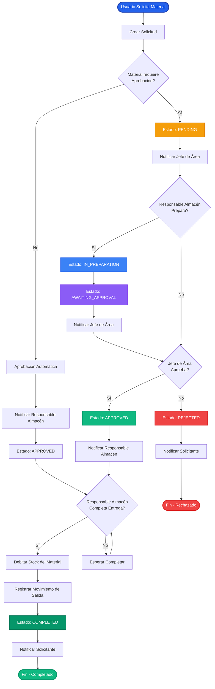
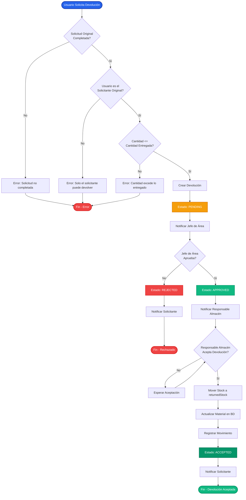
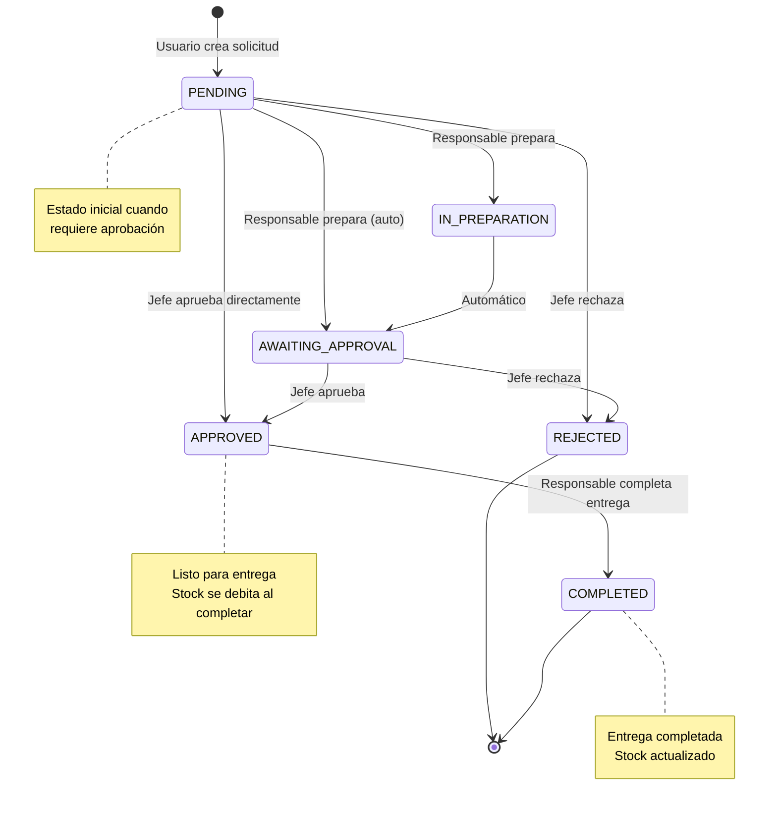
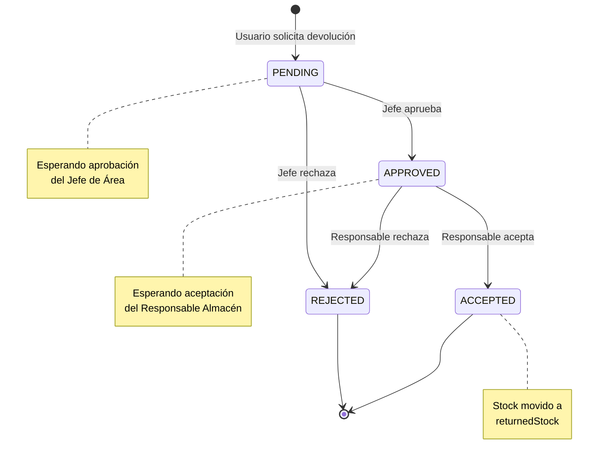
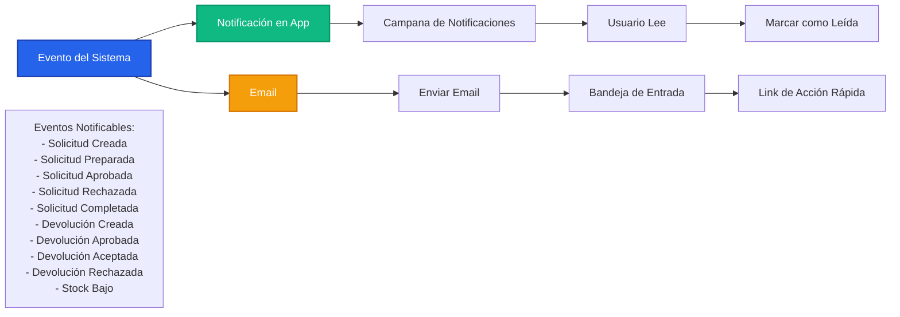
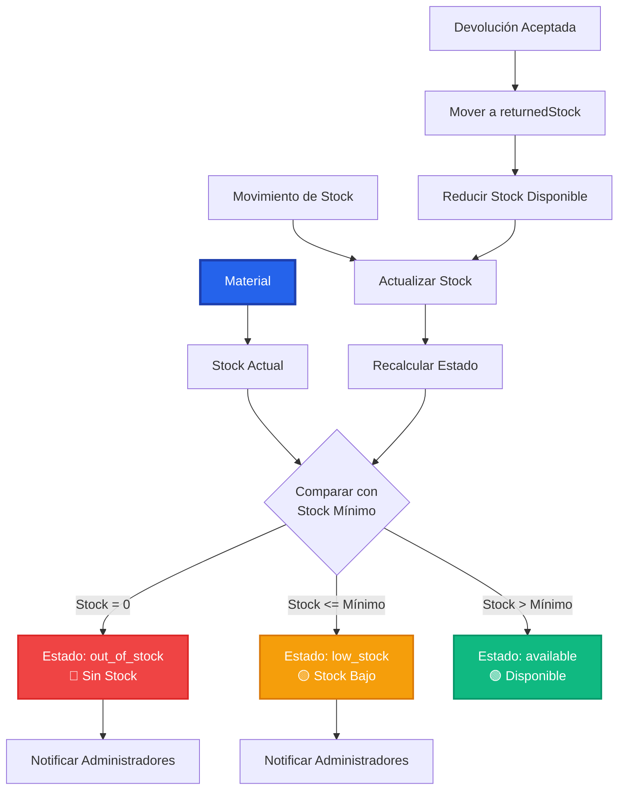

# 📊 Diagrama de Flujo - Módulo de Inventario de Materiales

## 🎯 Presentación del Sistema

---

## Slide 1: Vista General del Módulo

```mermaid
graph TB
    Start([Módulo de Inventario<br/>de Materiales]) --> GM[Gestión de Materiales]
    Start --> MS[Movimientos de Stock]
    Start --> SM[Solicitudes de Materiales]
    Start --> DM[Devoluciones de Materiales]
    
    GM --> CRUD[CRUD de Materiales]
    GM --> Stock[Control de Stock]
    GM --> Status[Estados: Disponible/Bajo/Sin Stock]
    
    MS --> Entrada[Entrada de Materiales]
    MS --> Salida[Salida de Materiales]
    MS --> Movimientos[Registro de Movimientos]
    
    SM --> CrearSolicitud[Crear Solicitud]
    SM --> Aprobar[Aprobar/Rechazar]
    SM --> Entregar[Completar Entrega]
    
    DM --> CrearDevolucion[Crear Devolución]
    DM --> AprobarDevolucion[Aprobar Devolución]
    DM --> AceptarDevolucion[Aceptar Devolución]
    
    style Start fill:#2563eb,stroke:#1e40af,stroke-width:3px,color:#fff
    style GM fill:#10b981,stroke:#059669,stroke-width:2px,color:#fff
    style MS fill:#f59e0b,stroke:#d97706,stroke-width:2px,color:#fff
    style SM fill:#8b5cf6,stroke:#7c3aed,stroke-width:2px,color:#fff
    style DM fill:#ef4444,stroke:#dc2626,stroke-width:2px,color:#fff
```

---

## Slide 2: Gestión de Materiales (CRUD)

---

## Slide 3: Movimientos de Stock

---

## Slide 4: Flujo de Solicitudes de Materiales

---

## Slide 5: Flujo de Devoluciones de Materiales

---

## Slide 6: Roles y Permisos

```mermaid
graph TB
    Usuario[Usuario Regular] --> PermisoUsuario[Permiso: warehouse_requests]
    Usuario --> AccionUsuario[Acciones:<br/>- Crear solicitudes<br/>- Ver sus solicitudes<br/>- Crear devoluciones]
    
    Manager[Responsable de Almacén<br/>WAREHOUSE_MANAGER] --> PermisoManager1[Permiso: warehouse_requests]
    Manager --> PermisoManager2[Permiso: warehouse_requests_manage]
    Manager --> AccionManager[Acciones:<br/>- Ver todas las solicitudes<br/>- Preparar solicitudes<br/>- Completar entregas<br/>- Aceptar devoluciones<br/>- Gestionar materiales<br/>- Registrar movimientos]
    
    Jefe[Jefe de Área<br/>AREA_CHIEF] --> PermisoJefe1[Permiso: warehouse_requests]
    Jefe --> PermisoJefe2[Permiso: warehouse_requests_approve]
    Jefe --> AccionJefe[Acciones:<br/>- Ver solicitudes pendientes<br/>- Aprobar/Rechazar solicitudes<br/>- Aprobar/Rechazar devoluciones]
    
    Admin[Administrador] --> PermisoAdmin[Permisos: Todos]
    Admin --> AccionAdmin[Acciones:<br/>- Todas las acciones<br/>- Configuración del sistema]
    
    style Usuario fill:#3b82f6,stroke:#2563eb,stroke-width:2px,color:#fff
    style Manager fill:#10b981,stroke:#059669,stroke-width:2px,color:#fff
    style Jefe fill:#8b5cf6,stroke:#7c3aed,stroke-width:2px,color:#fff
    style Admin fill:#ef4444,stroke:#dc2626,stroke-width:2px,color:#fff
```

---

## Slide 7: Estados de Solicitudes y Devoluciones

---

## Slide 8: Estados de Devoluciones

---

## Slide 9: Sistema de Notificaciones

---

## Slide 10: Control de Stock y Estados

---

## 📝 Resumen de Funcionalidades

### Gestión de Materiales
- ✅ Crear, editar, eliminar materiales
- ✅ Control de stock (mínimo, máximo, actual)
- ✅ Estados automáticos (disponible, bajo stock, sin stock)
- ✅ Categorización y ubicación
- ✅ Gestión de proveedores

### Movimientos de Stock
- ✅ Registro de entradas y salidas
- ✅ Historial completo de movimientos
- ✅ Notificaciones automáticas de stock bajo
- ✅ Trazabilidad de cada movimiento

### Solicitudes de Materiales
- ✅ Creación de solicitudes por usuarios
- ✅ Flujo de aprobación (Jefe de Área)
- ✅ Preparación y entrega (Responsable Almacén)
- ✅ Aprobación automática para materiales sin requerimiento
- ✅ Notificaciones en cada etapa

### Devoluciones de Materiales
- ✅ Solicitud de devolución por usuarios
- ✅ Aprobación por Jefe de Área
- ✅ Aceptación por Responsable Almacén
- ✅ Gestión de stock devuelto (returnedStock)

### Sistema de Notificaciones
- ✅ Notificaciones en app (campana)
- ✅ Notificaciones por email
- ✅ Configuración de destinatarios por evento
- ✅ Links de acción rápida

---

## 🎯 Conclusión

El módulo de Inventario de Materiales proporciona un sistema completo para:
- 📦 Gestión de inventario
- 🔄 Control de movimientos
- 📋 Procesamiento de solicitudes
- 🔙 Gestión de devoluciones
- 🔔 Sistema de notificaciones integrado

Todo con control de roles y permisos para garantizar la seguridad y el flujo correcto de operaciones.

